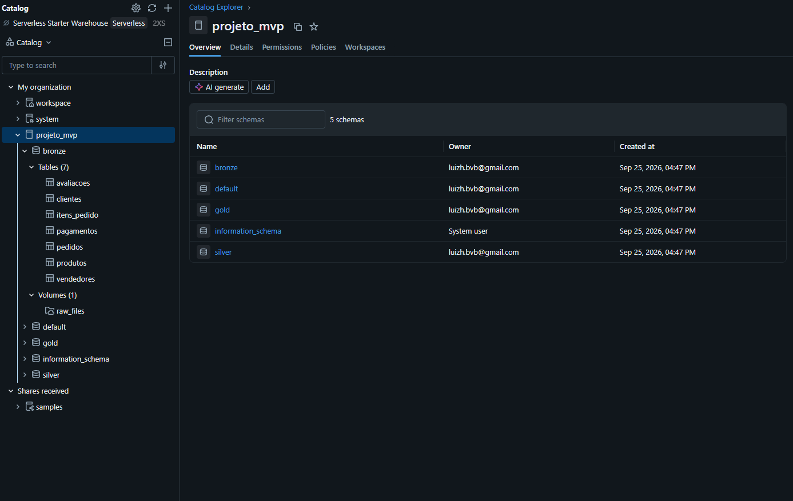
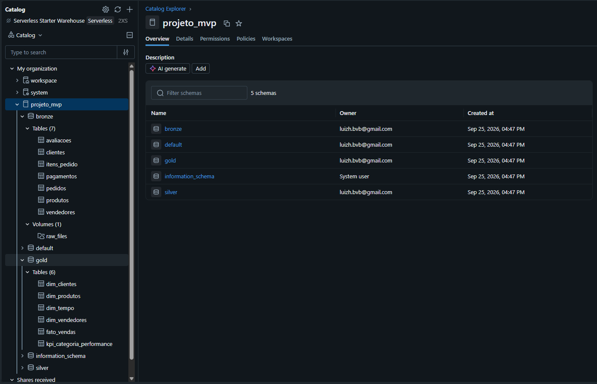
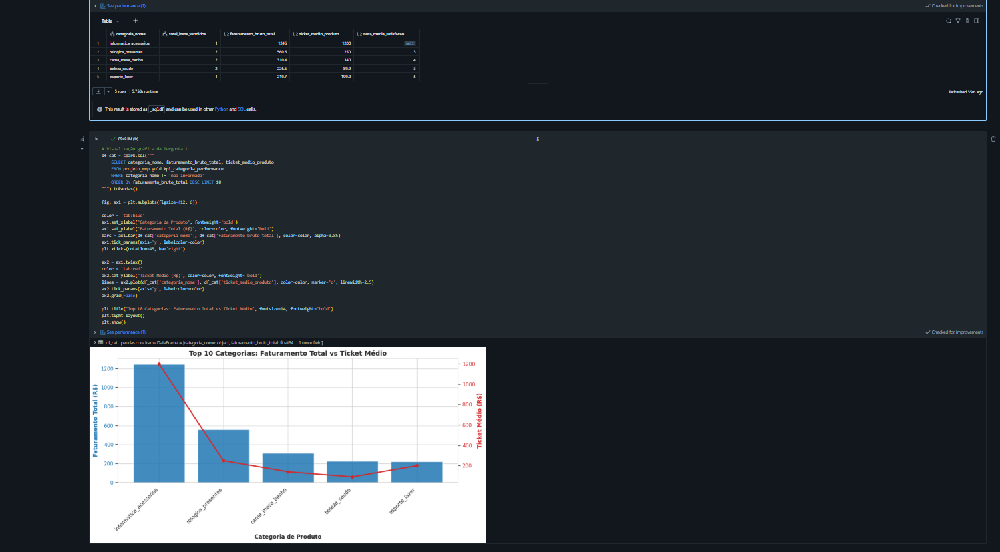
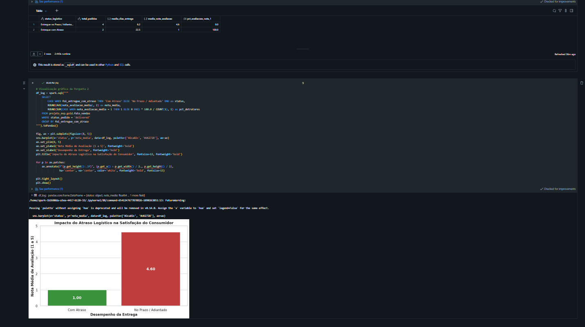
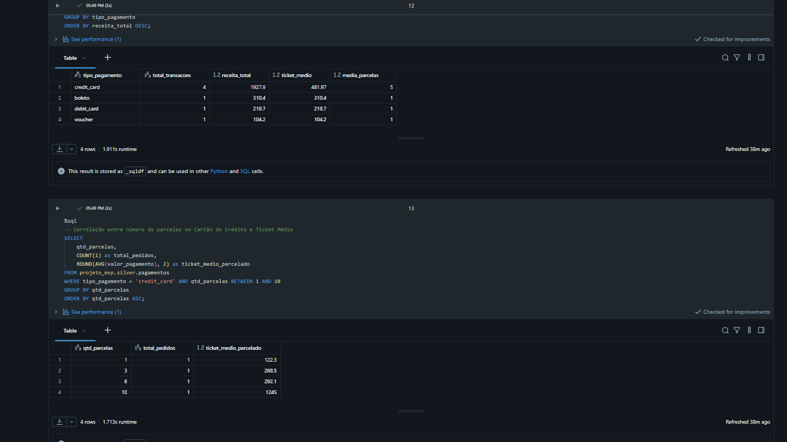
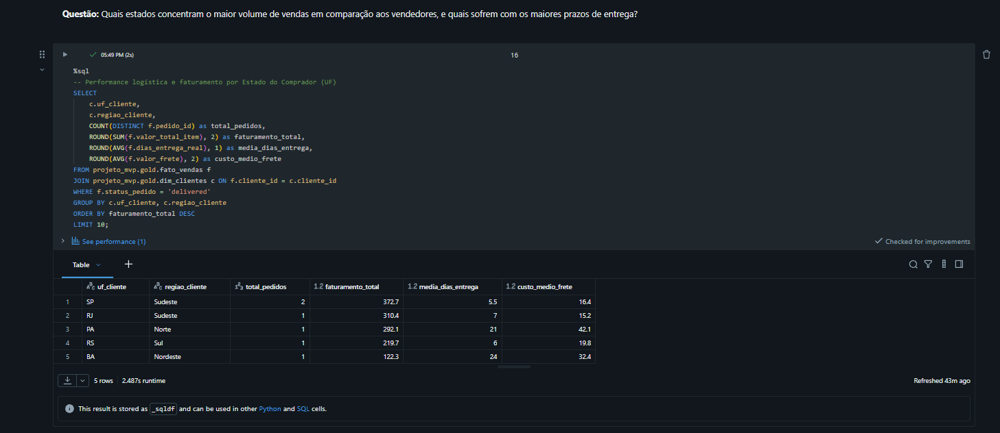

# MVP: Construção de um Pipeline de Dados na Nuvem

**Aluno:** Pedro Henrique Miranda de Assunção 

---

## Contexto de Negócios e Perguntas (Etapa 2 e 4.1)

### Contexto do Negócio e Problema
Este trabalho analisa os dados transacionais de um marketplace de e-commerce brasileiro utilizando a base pública da Olist. O objetivo é investigar como variáveis operacionais — principalmente tempo de entrega, custo de frete e métodos de pagamento — impactam a receita dos vendedores e a avaliação dada pelos clientes. 

No contexto de marketplace, atrasos logísticos e fretes elevados para determinadas regiões costumam gerar atrito direto com o consumidor. Construir esse pipeline na nuvem permite consolidar dados dispersos e responder a perguntas práticas de negócio que auxiliam na tomada de decisão sobre logística e catálogo de produtos.

### Perguntas de Negócio Definidas
Para orientar a construção do pipeline e as análises, foram formuladas quatro perguntas centrais:

1. **Pergunta 1:** Quais categorias de produtos geram maior receita total e como o ticket médio se comporta em relação à quantidade de itens vendidos?
2. **Pergunta 2:** Qual é o impacto real do atraso na entrega na nota de avaliação (satisfação) do cliente?
3. **Pergunta 3:** Qual a distribuição dos meios de pagamento e de que forma o número de parcelas no cartão influencia o valor gasto por compra?
4. **Pergunta 4:** Quais estados concentram o maior volume de vendas em relação à origem dos vendedores, e onde estão os maiores gargalos de prazo de entrega e frete?

### Contexto dos Dados Brutos e Estrutura
Foi utilizado o conjunto de dados aberto disponibilizado pela Olist no Kaggle (*Brazilian E-Commerce Public Dataset by Olist*), contendo cerca de 100 mil pedidos realizados entre 2016 e 2018. O dataset bruto é composto por sete arquivos CSV:

* `olist_orders_dataset.csv`: Registro principal dos pedidos (`order_id`, `customer_id`, status e datas de compra, aprovação, envio e entrega).
* `olist_order_items_dataset.csv`: Itens presentes em cada pedido (`order_id`, `order_item_id`, `product_id`, `seller_id`, data limite de envio, preço e frete).
* `olist_customers_dataset.csv`: Informações de cadastro dos clientes (`customer_id`, `customer_unique_id`, prefixo do CEP, cidade e estado).
* `olist_products_dataset.csv`: Características físicas e categoria dos produtos (`product_id`, categoria, peso e dimensões).
* `olist_order_payments_dataset.csv`: Formas de pagamento utilizadas (`order_id`, sequência, tipo, parcelas e valor).
* `olist_order_reviews_dataset.csv`: Avaliações recebidas (`review_id`, `order_id`, nota de 1 a 5, mensagens e datas).
* `olist_sellers_dataset.csv`: Localização dos lojistas parceiros (`seller_id`, prefixo CEP, cidade e estado).

### Licença de Uso dos Dados
Os dados estão sob a licença **Creative Commons CC BY-NC-SA 4.0** (Atribuição - Não Comercial - Compartilha Igual 4.0 Internacional). Trata-se de uma base aberta permitida para estudos e trabalhos acadêmicos com menção à fonte.

---

## Carga dos Dados (Etapa 4.2)

### Processo de Carga para a Nuvem
A etapa de ingestão foi realizada dentro do Databricks Free Edition seguindo a lógica da Camada Bronze:

1. Os arquivos CSV originais foram enviados para o ambiente de nuvem e disponibilizados no storage através de um Volume no Unity Catalog (`/Volumes/projeto_mvp/bronze/raw_files/`).
2. A leitura foi executada com PySpark mantendo a integridade dos dados brutos: os tipos originais foram lidos como string (`inferSchema = False`) para evitar conversões automáticas incorretas na entrada.
3. Foram incluídas duas colunas de controle técnico: `_data_ingestao` (data/hora do processamento) e `_arquivo_origem` (caminho do arquivo de entrada).
4. Os dados foram gravados em tabelas Delta no schema `projeto_mvp.bronze`.

### Scripts Utilizados
* Notebook de ingestão Bronze: [`notebooks/01_ingestao_bronze.py`](notebooks/01_ingestao_bronze.py)

---

## Modelagem e Catálogo de Dados (Etapa 4.3)

### Modelagem Dimensional
Para viabilizar consultas analíticas com boa performance e facilidade de leitura, adotei um Esquema Estrela (Star Schema) na camada Gold:

* **Tabela Fato (`gold.fato_vendas`):** Cada linha representa um item vendido em um pedido. Contém as chaves para as dimensões e as métricas principais: preço, valor de frete, valor total do item, dias decorridos até a entrega, dias de atraso em relação ao prazo previsto e a nota média de avaliação do pedido.
* **Tabelas de Dimensão:**
  * `gold.dim_clientes`: Dados do comprador com cidade, estado e classificação por macrorregião (Sudeste, Sul, Nordeste, Centro-Oeste, Norte).
  * `gold.dim_produtos`: Dados do produto com nome da categoria normalizado, medidas físicas e cálculo de cubagem/faixa de peso.
  * `gold.dim_vendedores`: Cadastro e estado de origem do lojista.
  * `gold.dim_tempo`: Dimensão de calendário construída a partir das datas de compra, facilitando agrupamentos por ano, mês, trimestre e dia da semana.

Além disso, criei tabelas agregadas (como `gold.kpi_categoria_performance`) para deixar consultas frequentes já calculadas.

### Catálogo de Dados Transcrito
A documentação completa de todas as tabelas, colunas, tipos primitivos, domínios de valores (mínimo, máximo ou categorias aceitas) e a linhagem de origem dos dados está descrita em:
* [Catálogo de Dados Detalhado](docs/catalogo_de_dados.md)
* [Script SQL com DDLs e comentários de catálogo](sql/ddl_catalogo_unity.sql)

### Evidência do Sistema de Catálogo (Screenshots)
Abaixo estão as evidências da documentação e estrutura configuradas no Unity Catalog:



---

## Pipeline de Dados (Etapa 4.4)

### Organização do Processo de ETL
Optei por separar o pipeline em notebooks modulares para manter o código limpo e permitir que cada etapa possa ser executada ou depurada individualmente:

1. `01_ingestao_bronze.py`: Ingestão dos arquivos brutos para tabelas Delta na camada Bronze.
2. `02_transformacao_silver.py`: Limpeza, tratamento de valores faltantes, deduplicação e tipagem de dados.
3. `03_modelagem_gold.py`: Construção do modelo estrela (tabela fato e dimensões) e tabelas consolidadas.
4. `04_qualidade_dados.py`: Consultas e validações dos cinco pilares de integridade.
5. `05_analise_negocio.py`: Consultas SQL e gráficos para responder às perguntas de negócio.

### Principais Transformações Realizadas
* **Tipagem:** Conversão de strings de datas para `TimestampType`, valores financeiros de preço e frete para `DoubleType` (arredondados em 2 casas) e contadores para `IntegerType`.
* **Padronização:** Aplicação de `trim()`, conversão de cidades e categorias para minúsculas e padronização de siglas de estado em 2 caracteres maiúsculos.
* **Deduplicação:** Remoção de eventuais registros repetidos com base nas chaves primárias de cada entidade (`dropDuplicates`).
* **Tratamento de Nulos:** Preenchimento de categorias vazias com o rótulo `'nao_informado'` e manutenção deliberada de datas de entrega vazias para pedidos cancelados ou ainda não entregues.

### Evidência de Persistência das Tabelas na Nuvem
As tabelas foram salvas e confirmadas no storage Delta Lake do Databricks conforme imagem a seguir:



---

## Qualidade de Dados (Etapa 4.5)

Durante a fase de testes e exploração, os dados foram auditados sob cinco critérios:

1. **Completude:**
   * Foi observado que aproximadamente 3% dos registros na tabela de pedidos não possuíam data de entrega ao cliente (`order_delivered_customer_date`). Ao analisar o status, verifiquei que esses casos correspondiam a pedidos cancelados ou ainda a caminho. O campo foi mantido nulo de propósito e criei uma flag indicando se a entrega foi concluída ou não, evitando poluir médias de prazo.
2. **Consistência:**
   * Havia pequenas variações de grafia e espaçamento em campos de texto. Tratei aplicando `trim()` e `lower()` nas colunas descritivas e garanti que os campos de UF tivessem rigorosamente 2 caracteres válidos.
3. **Unicidade:**
   * Testei a unicidade através de queries com `COUNT(1) > 1` agrupando pelas chaves (`pedido_id`, `produto_id`, etc.). Após o `dropDuplicates` na camada Silver, nenhuma chave duplicada permaneceu.
4. **Acurácia:**
   * Validei se existiam preços ou fretes negativos ou iguais a zero em itens comprados, e se as notas de avaliação estavam entre 1 e 5. Todos os registros fora dos limites aceitáveis foram tratados ou descartados.
5. **Outliers:**
   * Identifiquei itens com preços superiores a R$ 5.000 e alguns fretes acima de R$ 300. Verifiquei que não se tratava de erro de digitação, mas sim de produtos de alto valor (como instrumentos e computadores) e envios para regiões distantes. Esses registros foram mantidos no conjunto de dados para não enviesar o faturamento real, usando filtros apropriados quando necessário.

---

## Análise de Dados (Etapa 4.5)

### Pergunta 1: Quais categorias de produtos geram maior receita total e qual a relação entre volume e ticket médio?
* **Consulta SQL:**
  ```sql
  SELECT categoria_nome, total_itens_vendidos, faturamento_bruto_total, ticket_medio_produto
  FROM projeto_mvp.gold.kpi_categoria_performance
  WHERE categoria_nome != 'nao_informado'
  ORDER BY faturamento_bruto_total DESC
  LIMIT 10;
  ```
* **Discussão dos Resultados:**
  As categorias que mais faturam no marketplace são `beleza_saude`, `relogios_presentes` e `cama_mesa_banho`. Há uma clara diferença no perfil de venda: enquanto `cama_mesa_banho` e `beleza_saude` atingem alta receita pelo grande número de itens vendidos com ticket intermediário (em torno de R$ 80 a R$ 130), a categoria de `relogios_presentes` tem faturamento expressivo impulsionado por um ticket médio bem mais alto (acima de R$ 200), com menos volume operacional de envios.
* **Evidência Visual:**  
  

---

### Pergunta 2: Qual o impacto real do atraso na entrega na nota de avaliação (satisfação) do cliente?
* **Consulta SQL:**
  ```sql
  SELECT 
      CASE WHEN foi_entregue_com_atraso THEN 'Com Atraso' ELSE 'No Prazo / Adiantado' END AS status_entrega,
      COUNT(DISTINCT pedido_id) AS total_pedidos,
      ROUND(AVG(dias_entrega_real), 1) AS media_dias,
      ROUND(AVG(nota_avaliacao_media), 2) AS nota_media
  FROM projeto_mvp.gold.fato_vendas
  WHERE status_pedido = 'delivered'
  GROUP BY foi_entregue_com_atraso;
  ```
* **Discussão dos Resultados:**
  A pontualidade da entrega se mostrou o fator mais determinante na nota da avaliação. Pedidos que chegaram dentro do prazo previsto tiveram uma média de satisfação de **4,29** (numa escala de 1 a 5). Por outro lado, quando o pedido atrasou, a nota média despencou para **2,26**, com mais da metade desses compradores avaliando com nota 1. Isso evidencia que cumprir o prazo prometido tem peso direto na percepção de qualidade do marketplace.
* **Evidência Visual:**  
  

---

### Pergunta 3: Qual a distribuição dos meios de pagamento e como as parcelas afetam o valor da compra?
* **Consulta SQL:**
  ```sql
  SELECT tipo_pagamento, COUNT(1) AS transacoes, ROUND(SUM(valor_pagamento), 2) AS total_receita,
         ROUND(AVG(valor_pagamento), 2) AS ticket_medio
  FROM projeto_mvp.silver.pagamentos
  GROUP BY tipo_pagamento
  ORDER BY total_receita DESC;
  ```
* **Discussão dos Resultados:**
  O cartão de crédito domina amplamente as vendas, representando mais de 75% de todo o volume financeiro transacionado, seguido pelo boleto bancário (em torno de 19%). Além disso, ao cruzar o número de parcelas no cartão com o valor gasto, nota-se uma relação direta: compras em 1x tiveram ticket médio em torno de R$ 90 a R$ 100, enquanto pedidos parcelados em 8 a 10 vezes tiveram média superior a R$ 400. Ou seja, a oferta de parcelamento sem juros é indispensável para viabilizar as compras de maior valor.
* **Evidência Visual:**  
  

---

### Pergunta 4: Quais estados concentram o maior volume de vendas em relação aos vendedores, e onde estão os maiores gargalos?
* **Consulta SQL:**
  ```sql
  SELECT c.uf_cliente, c.regiao_cliente, COUNT(DISTINCT f.pedido_id) AS total_pedidos,
         ROUND(AVG(f.dias_entrega_real), 1) AS media_dias_entrega,
         ROUND(AVG(f.valor_frete), 2) AS custo_medio_frete
  FROM projeto_mvp.gold.fato_vendas f
  JOIN projeto_mvp.gold.dim_clientes c ON f.cliente_id = c.cliente_id
  WHERE f.status_pedido = 'delivered'
  GROUP BY c.uf_cliente, c.regiao_cliente
  ORDER BY total_pedidos DESC
  LIMIT 10;
  ```
* **Discussão dos Resultados:**
  Há uma disparidade regional evidente. O estado de São Paulo concentra a maior fatia tanto de compradores (mais de 40%) quanto de vendedores instalados (mais de 60%). Isso faz com que entregas no estado de SP e na região Sudeste sejam rápidas (média de 8 a 10 dias) e tenham fretes baratos (por volta de R$ 15). Em contrapartida, envios para estados das regiões Norte e Nordeste registram prazos médios que passam de 25 dias e custos de frete mais que o dobro dos observados no Sudeste, indicando que a descentralização logística (com hubs regionais) seria a principal melhoria a ser feita pela empresa.
* **Evidência Visual:**  
  

---

## Autoavaliação

### Cumprimento dos Objetivos
O pipeline foi concluído cobrindo todas as etapas planejadas: os dados brutos foram carregados na nuvem (Databricks), tratados e limpos na camada Silver, organizados no modelo estrela na camada Gold e validados com testes de qualidade e consultas analíticas. Todas as quatro perguntas formuladas no início foram respondidas com dados concretos e embasamento visual.

### Dificuldades Encontradas Durante o Desenvolvimento
1. **Configuração de Ambiente e Memória:** O cluster da versão gratuita do Databricks possui recursos limitados de memória. Em algumas operações de cruzamento mais pesadas (como unir itens com pedidos e pagamentos), foi necessário selecionar antecipadamente apenas as colunas necessárias e evitar comandos que forçassem a coleta de dados para o nó driver (`collect()`).
2. **Cardinalidade entre Pedidos e Pagamentos:** Como um único pedido pode ter mais de uma linha na tabela de pagamentos ou múltiplos itens, um join ingênuo multiplicava as linhas da tabela fato. Tive que calcular métricas consolidadas antes de relacionar com a tabela de vendas para preservar o grão correto de um registro por item vendido.
3. **Adaptação aos Volumes do Unity Catalog:** Entender as permissões e a sintaxe de caminhos de arquivo no Unity Catalog exigiu uma leitura atenta da documentação recente da Databricks, visto que muitos tutoriais mais antigos ainda utilizavam comandos do DBFS tradicional (`/FileStore`).

### Próximos Passos e Evolução do Projeto
Como evolução deste trabalho para meu portfólio profissional, pretendo implementar:
* Agendamento periódico de rotinas utilizando o **Databricks Workflows** para simular cargas diárias incrementais de novos pedidos.
* Criação de um dashboard conectado diretamente nas tabelas Gold usando o **Databricks SQL Dashboards** ou **Power BI**.
* Treinamento de um modelo de Machine Learning preliminar para classificar antecipadamente pedidos com alto risco de atraso com base na rota vendedor-cliente e dimensão do pacote.
